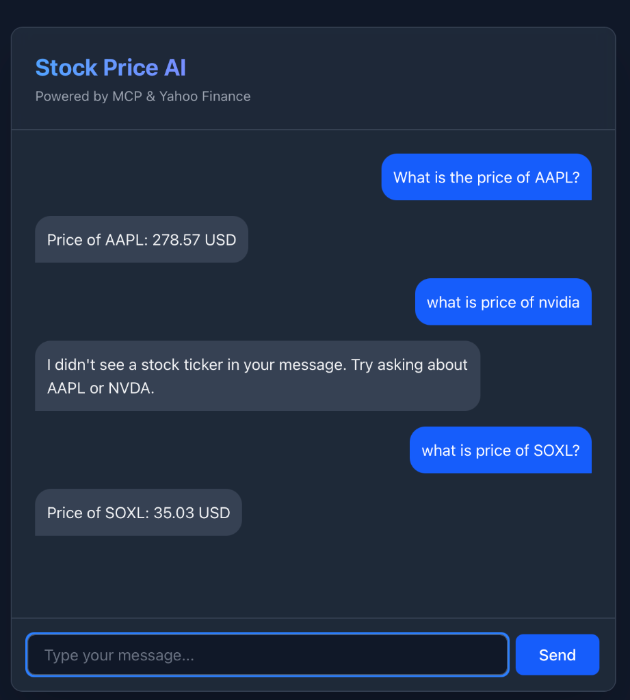

# AI Stock Price App with MCP



This project demonstrates how to build a full-stack application using the **Model Context Protocol (MCP)** to connect an AI agent (simulated) to real-time data.

## 🚀 Concepts

The core idea is to break out of the "Brain in a Jar" limitation of LLMs by giving them access to external tools via a standardized protocol.

-   **MCP Server**: A standalone service that exposes "tools" (capabilities) to any MCP-compliant client. In this case, it exposes a `get_stock_price` tool.
-   **MCP Client**: The entity that connects to the server and calls the tools. Here, our Backend acts as the client.
-   **Transport**: The communication channel. We use `StdioServerTransport`, meaning the Client spawns the Server as a subprocess and talks over standard input/output (stdin/stdout).

## 🛠️ Technology Stack

### 1. MCP Server (`mcp-server`)
The "Tool Provider".
-   **Node.js & TypeScript**: Runtime and language.
-   **@modelcontextprotocol/sdk**: The official SDK to define servers and tools.
-   **yahoo-finance2**: A library to scrape real-time stock data from Yahoo Finance.

### 2. Backend (`web-app/server`)
The "MCP Client" and API layer.
-   **Express**: Web server to handle frontend requests.
-   **@modelcontextprotocol/sdk**: Used here as a *Client* to connect to the MCP Server.
-   **Stdio Transport**: Connects to the local MCP server process securely without network ports.

### 3. Frontend (`web-app/client`)
The User Interface.
-   **React (Vite)**: Fast, modern web framework.
-   **TailwindCSS v4**: Utility-first CSS framework for styling.
-   **Design**: Dark mode, glassmorphism effects, and responsive layout.

## 🏃‍♂️ How to Run

1.  **Install Dependencies**:
    ```bash
    npm install
    ```

2.  **Build All Packages**:
    ```bash
    npm run build -w mcp-server
    npm run build -w web-app/server
    npm run build -w web-app/client
    ```

3.  **Start Backend**:
    ```bash
    cd web-app/server
    npm start
    ```

4.  **Start Frontend**:
    ```bash
    cd web-app/client
    npm run dev
    ```

5.  **Use the App**:
    Open the frontend URL (usually `http://localhost:5173`), type "What is the price of NVDA?", and watch the system fetch live data!
